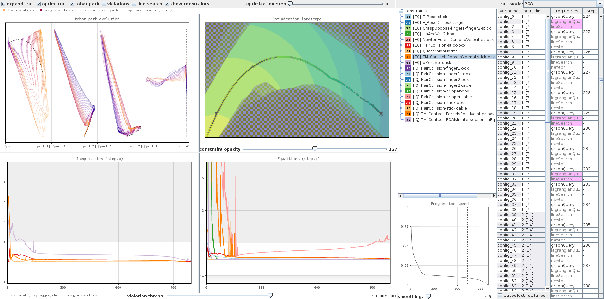

# 2020-VINCI-VisNLP
Code supplement for 

__Visualization of Nonlinear Programming for Robot Motion Planning__

*David Hägele, Moataz Abdelaal, Ozgur S. Oguz, Marc Toussaint, Daniel Weiskopf*

submitted to VINCI 2020.



## Description
This repository contains the code base for the visual analytics system presented in the aforementioned paper, as well as the corresponding robot motion planning system that it is coupled with. The motion planning system is capable of calculating robot motion paths by means of nonlinear programming. The VA system allows for a visual analysis of a constrained optimization run executed by the motion planning system.

## Build
On Ubuntu 18.04:

Use the `build_all.sh` script or have a look at the READMEs of the two systems.

## Run
The motion planning system has to perform an optimization first before the VA system can launched to analyze it.
For this any of the example problems 0, 1, or 2 can be launched.
```
cd motionplanner/problem0   # go to respective directory
./x.exe                     # execute notion planner (will perform an optimization and then idle)
```
The motion planner will create a log file of its optimization run and start an HTTP server to which the VA system can connect for sampling the optimization space.

In another shell, start the VA system, specifying the respective problem.
```
cd vasystem
java -jar visnlp.jar problem0
```
